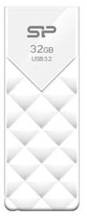
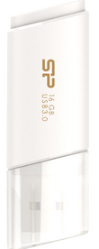
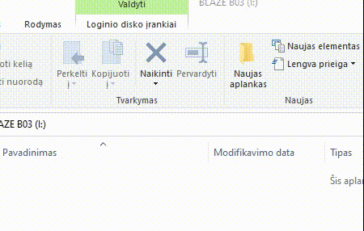
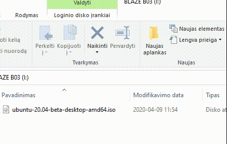
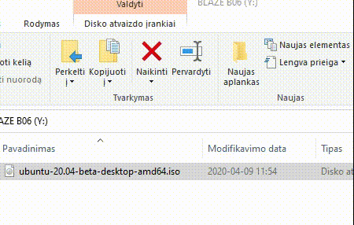

# silicon-power-usb-flash-drives-test

## USB Flash Drives
| Image | Model        | USB version           | Daugiau informacijos  | Produkto Numeris | Talpa | Kada Pirktas |
| ---- | ------------- |:-------------:| :-----:| -----:| -----:|-----:|
|  | Blaze B03      | USB 3.2 Gen 1 | https://www.silicon-power.com/web/product-B03 | SP032GBUF3B03V1W | 32GB | 2020 |
|  | Blaze B06      | USB 3.1 Gen1 / USB 3.0, USB 2.0 compatible | https://www.silicon-power.com/web/product-Blaze_B06 | SP016GBUF3B06V1W | 16GB | 2013 |

## Bandymai, naudojamas senas kompiuteris su USB3.0 jungtimi ir SSD disku

| Image | Model        | USB version           |  Įrašymo bandymas | Iškėlimo bandymas |
| ---- | ------------- |:-------------:|:-------------:| :-------------:|
|  | Blaze B03      | USB 3.2 Gen 1 |  |  |
|  | Blaze B06      | USB 3.1 Gen1 / USB 3.0, USB 2.0 compatible |  |  |

Naudojant 2013 Toshiba L855 Nešiojamą kompiuterį rezultatai tokie pat.
* Nešiojamas kompiuteris taip pat turi SSD.
